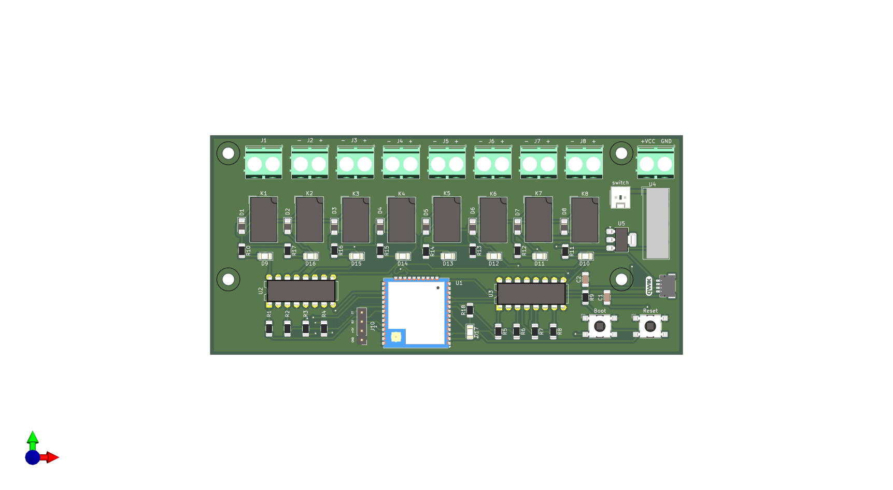

# ESPHome Sprinkler System

The ESPHome Sprinkler System is designed to bring advanced, automated control to your irrigation system, leveraging the power of the ESP32 microcontroller and seamless integration with Home Assistant.

This board offers a robust and flexible platform for managing up to 8 independent irrigation zones. It’s engineered for reliability and ease of use, making it ideal for both DIY enthusiasts and professional installers looking to upgrade traditional irrigation systems to a smart, app-controlled environment.

Is designed to be compatible with both 12V DC and 24V AC irrigation solenoid valves, depending on the specific model of the board. This flexibility ensures it can integrate with a wide range of existing irrigation systems, reducing the need for costly valve replacements.

A serial adapter is needed for programming the board for the first time. Once configured, you can update the new code via OTA in ESPHome or Arduino IDE.

---

## Pinout

---
---

## 🧩 Specifications

- **Power Supply:** 12V or 24V DC input  
- **Qwiic Connector:** For I²C peripherals (3,3V)   
- **ESPHome Compatible:** Designed to easily integrate in ESPHome with the [Sprinkler Component](https://esphome.io/components/sprinkler/)  
- **Reliable Relay Outputs:** Each zone is controlled by a dedicated relay, ensuring robust switching for your solenoid valves.

---

---
